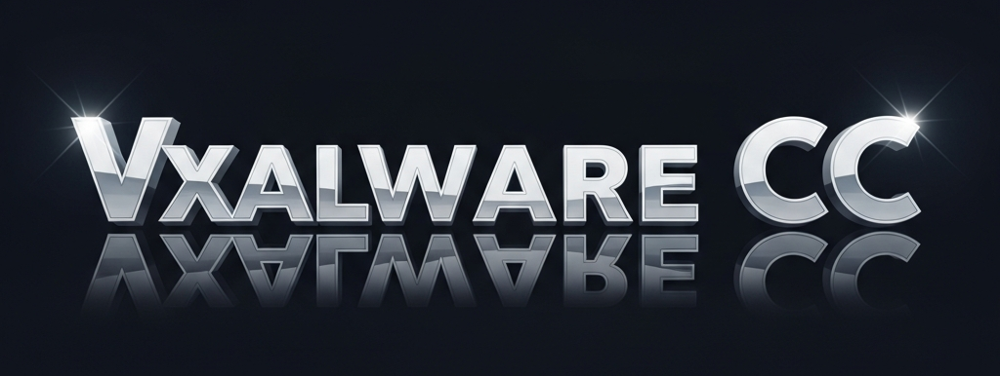

# Vxalware Loader
*Vxalware Loader is a bedwars script hub with sleek features and custom configs honed to perfection*
## Links:
[Discord](https://dsc.gg/VxalwareCC)
[YouTube](https://www.youtube.com/@OfficialStarGazerPro)
## Usage:
1. Download the specific scripting utility of your choice
2. Execute the provided loadstring below
```lua
loadstring(game:HttpGet("https://raw.githubusercontent.com/vxalware-bedwars-owner/Vxalware/refs/heads/main/MainScript.lua",true))()
```
## Credits:
- Vxalware (Frontend)
- SynthX (Backend)
- Footagesus (UI Library)
## Update: 3.3.4
[+] Added, [-] Removed, [!] Fixed, [#] Modified/Changed

- [+] Added CatVape chat tag autoexecute
- [#] Rewrote CatVape Config loader
- [+] Added protection for custom CV users
- [+] Added Beta testing
- [!] Fixed CV loader not working
- [#] Universally changed CatV5 to CatVape
- [#] Rewrote Rust Config loader
- [#] Cleaned up assets for config preps
- [+] Added Vxalware image to readme
- [!] Fixed incorrect loadstrings
- [!] Added users to custom loaders
