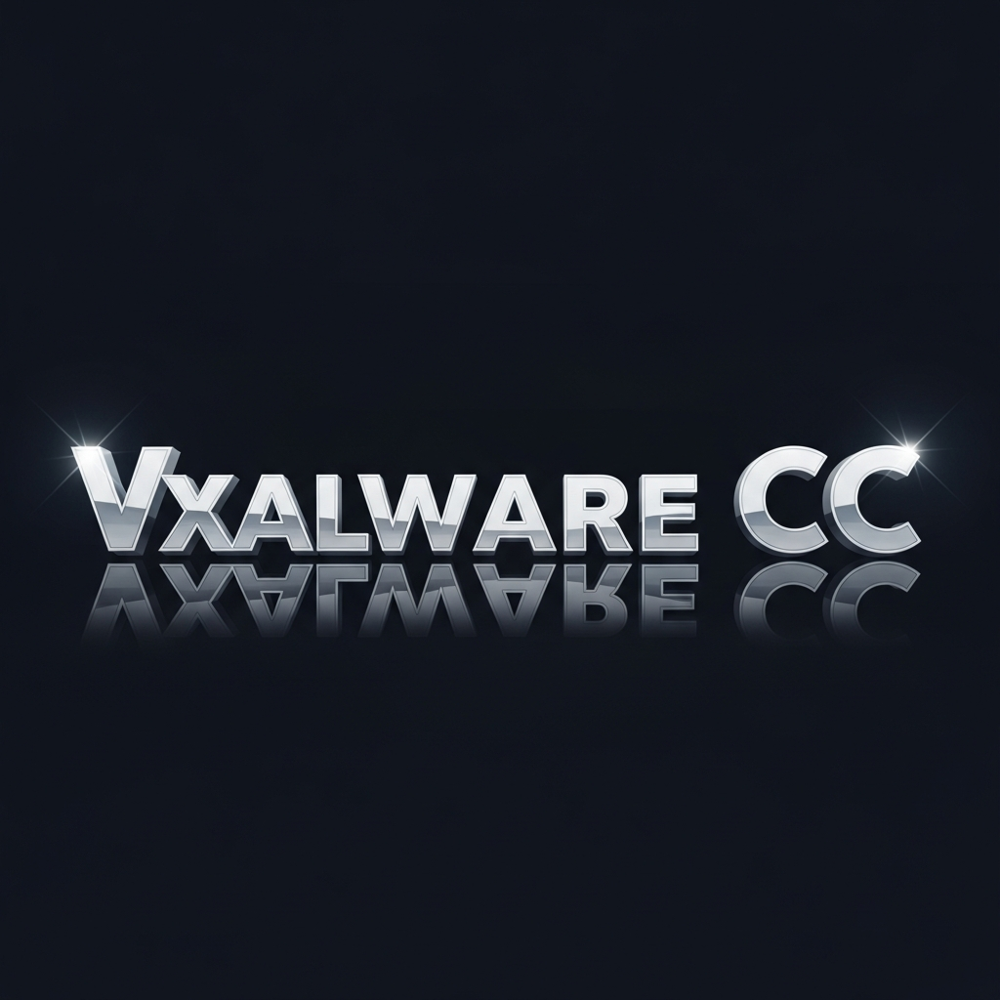

# Vxalware CC
**Vxalware CC** is a feature-rich BedWars script hub designed with performance, stability, and customization in mind. It provides a streamlined experience with optimized module configs, structured configuration management, and a refined user interface.

## 🔗 Links
* **Discord:** [https://dsc.gg/VxalwareCC](https://dsc.gg/VxalwareCC)
* **YouTube:** [https://www.youtube.com/@OfficialStarGazerPro](https://www.youtube.com/@OfficialStarGazerPro)

## 🚀 Usage
1. Download your preferred scripting utility.
2. Execute the following loader:

```lua
loadstring(game:HttpGet("https://raw.githubusercontent.com/vxalware-bedwars-owner/Vxalware/refs/heads/main/MainScript.lua",true))()
```

## 👥 Credits
* **Vxalware** — Frontend Development
* **SynthX** — Backend Development
* **Footagesus** — UI Library

## 📦 v3.3.5 Changelog
**Legend:**
`[+]` Added `[-]` Removed `[!]` Fixed `[#]` Modified/Changed

* `[!]` Fixed Various User Authentication issues
* `[+]` Added Wind UI VC (Version Check) API
* `[!]` Fixed runWithNotify API Slider issues
* `[#]` Changed FOV Changer to Beta Slider element
* `[#]` Rewrote Github Readme
* `[-]` Removed element lock for Credits tab
* `[#]` Minor changes to Animation Changer Code
* `[+]` Added WindUI User code
* `[+]` Added pre-made rust config **for now**

---
For support, updates, and community discussions, join the Discord server above.
